### `boda@github ~ $ ./contributions.sh`

  

### `boda@github ~ $ whoami`

<table>
  <tr>
    <td valign="top"></td>
    <td valign="top"></td>
  </tr>
</table>

 

### `boda@github ~ $ cat featured-projects.md`

| Project | What I built | Stack | Links |
|---|---|---|---|
| **Egypt Elevators** | A production-grade bilingual platform for a panorama-elevator company, with an AI concierge, inspection lead flow, robust SEO, and accessibility-aware motion. | Next.js 16 · React 19 · TypeScript · GSAP · PostgreSQL · Drizzle | [Live](https://elevators-misr.vercel.app) · [Code](https://github.com/bodajava/ELEVATORS-MISR) |
| **Opps** | A full-stack cookie commerce platform for Egypt with authentication, RBAC, inventory tracking, orders, payments architecture, and an analytics dashboard. | Next.js · NestJS · MongoDB · TypeScript · TanStack Query | [Live](https://opps-delta.vercel.app) · [Code](https://github.com/bodajava/opps) |
| **Grosha** | An animated export and logistics website presenting products, quality controls, seasonal availability, and global shipping operations. | Next.js · TypeScript · GSAP · Framer Motion | [Live](https://grosha.vercel.app) · [Code](https://github.com/bodajava/Grosha--) |
| **Real-Time Match Commentary** | A secure sports commentary backend delivering live match updates over WebSockets with typed database access and request validation. | Node.js · Express · WebSockets · PostgreSQL · Drizzle · Zod | [Live](https://real-time-application-xi.vercel.app) · [Code](https://github.com/bodajava/real-time-application) |

### `boda@github ~ $ ./contact --open-to-work`

I'm a frontend-focused engineer in Giza, Egypt, available for freelance and full-time opportunities. 
I build fast, expressive interfaces and production-ready full-stack products.

